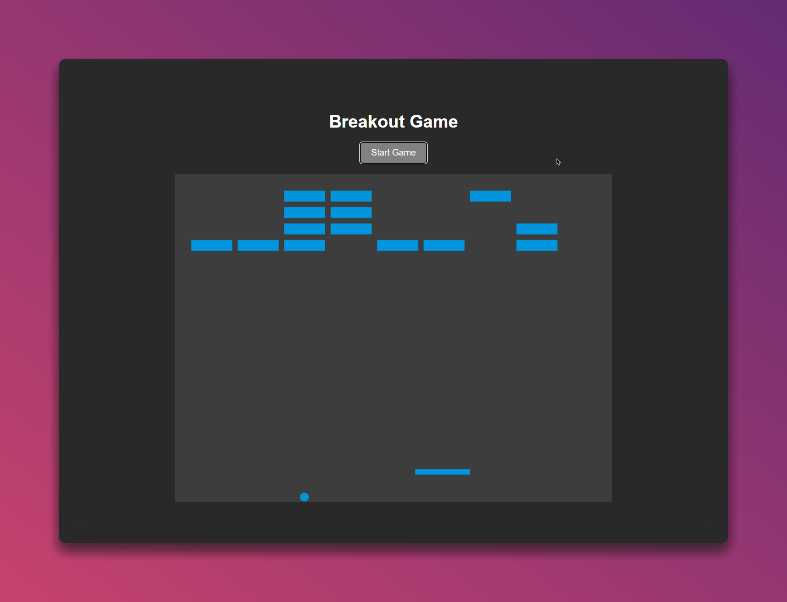

# 🎮 Breakout Game



A classic Breakout game implemented using HTML5 Canvas and JavaScript. Try to break all the bricks with the ball while controlling a paddle at the bottom of the screen.

[](https://github.com/EXELVI/Breakout_game/stargazers)
[](https://github.com/EXELVI/Breakout_game)
[](https://github.com/EXELVI/Breakout_game/issues)
[](https://github.com/EXELVI/Breakout_game/commits/main)

## 🚀 Features

- Classic Breakout gameplay
- Responsive controls using arrow keys
- Game over and restart functionality
- Simple UI

## 🛠️ Installation

To get started with the Breakout game, follow these steps:

1. **Clone the repository:**

    ```bash
    git clone https://github.com/EXELVI/Breakout_game.git
    ```

2. **Navigate to the project directory:**

    ```bash
    cd Breakout_game
    ```

3. **Open `index.html` in your browser:**

    Simply double-click the `index.html` file to open it in your default web browser.

## 🕹️ Usage

1. Open the `index.html` file in a web browser.
2. Click the "Start Game" button to begin playing.
3. Use the **Left Arrow** and **Right Arrow** keys to move the paddle.
4. The game will end when the ball falls below the paddle. You will be prompted to restart or exit.

## 🤝 Contributing

Contributions, issues and feature requests are welcome! Feel free to check the [issues page](https://github.com/EXELVI/Breakout_game/issues)!

